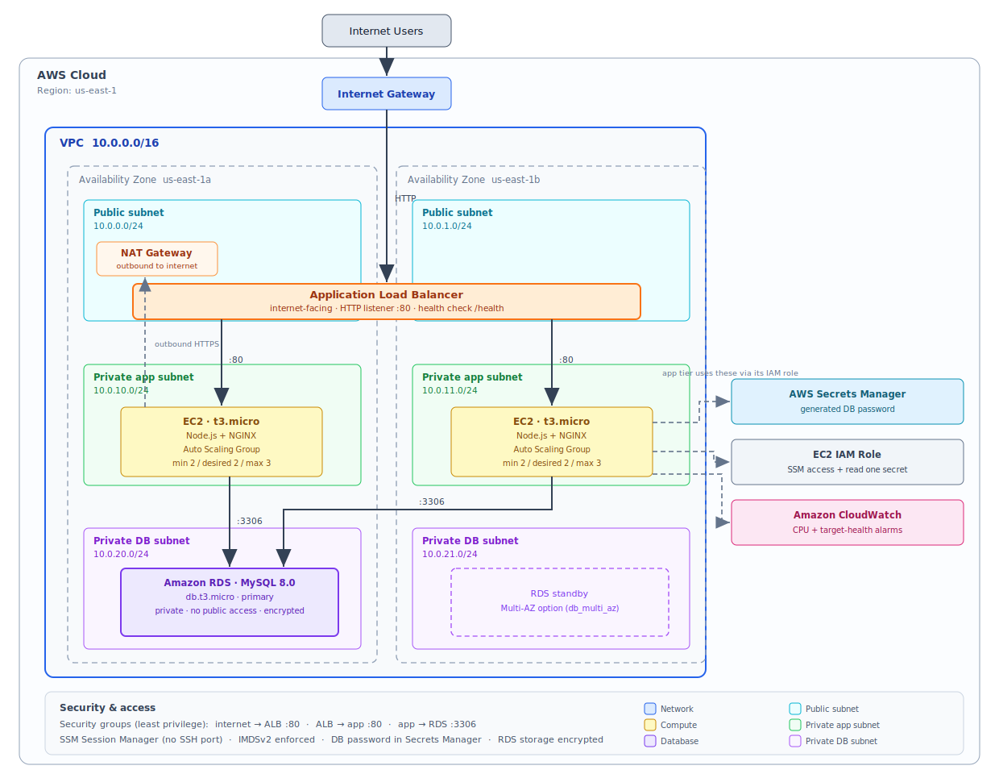
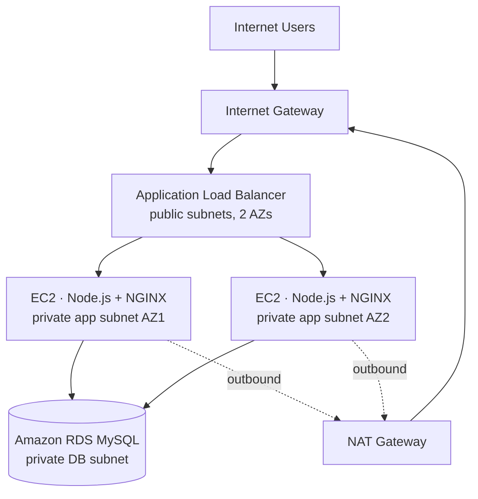

# Highly Available & Scalable Student Records on AWS

A production-style **3-tier web application** deployed on AWS as **Infrastructure as Code**.
A university student-records CRUD app runs behind an **Application Load Balancer** across an
**EC2 Auto Scaling Group** in private subnets, backed by a private **Amazon RDS (MySQL)**
database — all inside a custom VPC with public/private subnet isolation across two
Availability Zones.

The same architecture is provided in **both Terraform and AWS CloudFormation**.

[](https://github.com/shatchakra69/aws-student-records-ha/actions/workflows/ci.yml)

> Rebuilt end-to-end as a personal portfolio project. The original was a group lab
> exercise; this repository reconstructs the entire stack from scratch as reproducible,
> automatically-validated code.

---

## Architecture



<details>
<summary>Diagram as Mermaid (source)</summary>


</details>

| Tier | Service | Placement |
|------|---------|-----------|
| Edge | Application Load Balancer | Public subnets |
| Compute | EC2 Auto Scaling Group (Node.js app) | Private subnets |
| Data | Amazon RDS for MySQL | Private subnets, app-tier access only |
| Egress | NAT Gateway | Public subnet |

**Design highlights**

- **Highly available:** app tier spans two AZs behind the ALB; Auto Scaling replaces failed instances.
- **Secure by default:** RDS has no public access; least-privilege security groups chain
  `internet → ALB → app → RDS`; shell access is via **SSM Session Manager** (no SSH port open).
- **No hardcoded secrets:** the DB password is generated at deploy time and stored in
  **AWS Secrets Manager**, read by instances through an IAM role.
- **Observability:** CloudWatch alarms on app-tier CPU and ALB target health.

---

## Tech stack

- **App:** Node.js, Express, EJS, MySQL (`mysql2`)
- **Infra:** Terraform **and** CloudFormation
- **AWS:** VPC, ALB, EC2 Auto Scaling, RDS (MySQL), Secrets Manager, CloudWatch, IAM, NAT/Internet Gateway
- **CI:** GitHub Actions — app lint/test, `terraform validate`, `cfn-lint`

---

## Run it locally

The app runs fully on your machine before any AWS deployment.

```bash
# Option A — Docker (app + MySQL together)
docker compose up --build       # then open http://localhost:3000

# Option B — Node directly (needs a local MySQL)
cd app && cp .env.example .env   # edit DB_* values
npm install && npm start
```

Health endpoints: `GET /health` (shallow, used by the ALB) · `GET /health/db` (deep, checks the database).

---

## Deploy to AWS

First push this repo to GitHub (public) so instances can clone the app at boot, then pick one:

**Terraform** — see [`terraform/README.md`](terraform/README.md)

```bash
cd terraform
cp terraform.tfvars.example terraform.tfvars   # set app_repo_url
terraform init && terraform apply
# open the printed application_url; run `terraform destroy` when done
```

**CloudFormation** — see [`cloudformation/README.md`](cloudformation/README.md)

```bash
aws cloudformation deploy --template-file cloudformation/student-records.yaml \
  --stack-name student-records --capabilities CAPABILITY_NAMED_IAM \
  --parameter-overrides AppRepoUrl=https://github.com/shatchakra69/aws-student-records-ha.git
```

Instances take ~3–5 minutes to bootstrap and pass health checks. Cost is roughly
**$80/month** if left running 24/7; tear it down after a demo and it's a couple of dollars.
Full breakdown: [`docs/cost.md`](docs/cost.md).

---

## Screenshots

> _Add screenshots of the running app and AWS console here after your first deploy
> (`docs/screenshots/`)._

---

## Repository layout

```
.
├── app/                 # Node.js student-records CRUD application
├── terraform/           # Infrastructure as Code (primary)
├── cloudformation/      # Equivalent stack in native AWS CloudFormation
├── docs/                # Architecture diagram, cost notes, screenshots
├── Makefile             # Common tasks (make help)
└── .github/workflows/   # CI pipeline
```

## License

[MIT](LICENSE) © Shat Chakra Pawar Amgothu
