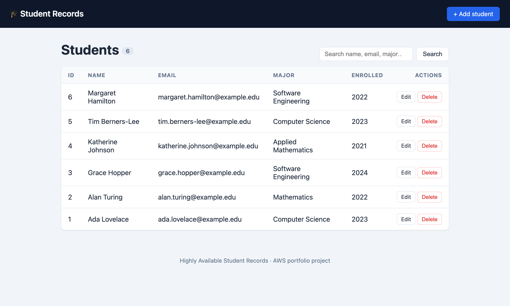
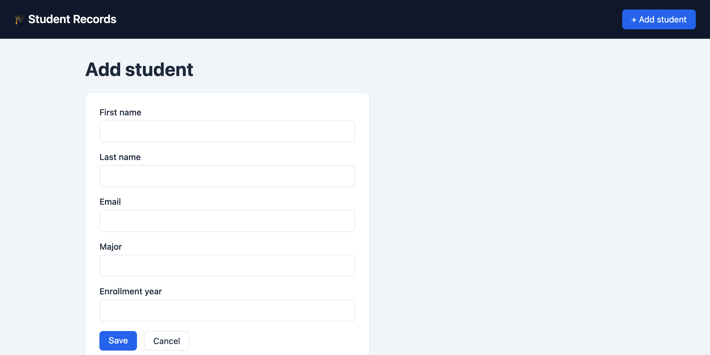
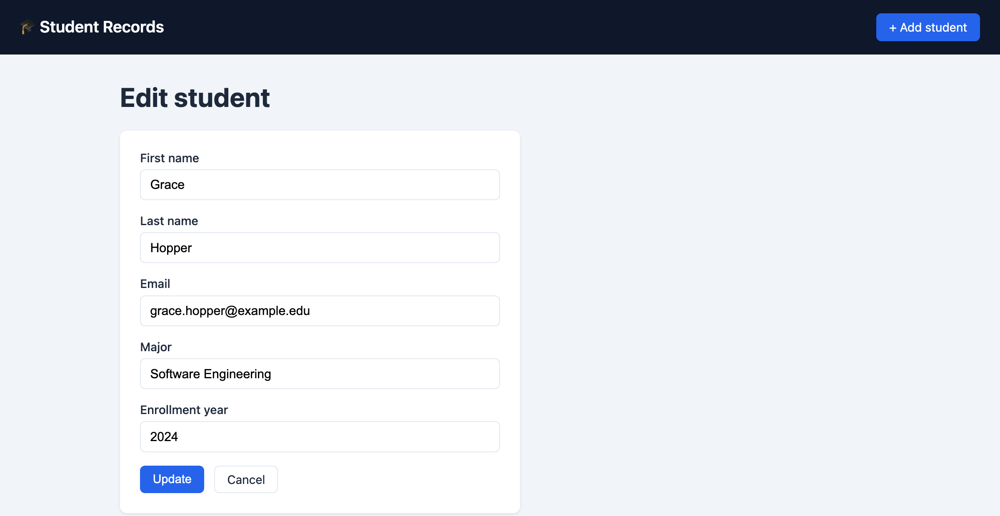

# Highly Available and Scalable Student Records on AWS

A production grade, three tier web application deployed on AWS as **Infrastructure as Code**.
A student records CRUD app runs behind an **Application Load Balancer** across an
**EC2 Auto Scaling Group** in private subnets, backed by a private **Amazon RDS (MySQL)**
database, all inside a custom VPC with public and private subnet isolation across two
Availability Zones. The same architecture is provided in **both Terraform and AWS CloudFormation**.

[](https://github.com/shatchakra69/AWS-Student-Records/actions/workflows/ci.yml)

> Built as a personal cloud engineering portfolio project. The entire stack is
> reproducible, automatically validated Infrastructure as Code.

## Architecture


<details>
<summary>Text-based version (Mermaid source)</summary>


</details>

Request path: **Internet → ALB (port 80) → EC2 app tier (port 80) → RDS MySQL (port 3306)**.
Each tier accepts traffic only from the tier directly in front of it.

| Tier | Service | Placement |
|------|---------|-----------|
| Edge | Application Load Balancer | Public subnets |
| Compute | EC2 Auto Scaling Group (Node.js app) | Private subnets |
| Data | Amazon RDS for MySQL | Private subnets, reachable only by the app tier |
| Egress | NAT Gateway | Public subnet |

**Design highlights**

- **Highly available:** the app tier spans two Availability Zones behind the ALB, and Auto Scaling replaces failed instances automatically.
- **Secure by default:** RDS has no public access, least privilege security groups chain `internet to ALB to app to RDS`, and shell access is via **SSM Session Manager** with no SSH port open.
- **No hardcoded secrets:** the database password is generated at deploy time and stored in **AWS Secrets Manager**, then read by instances through an IAM role.
- **Observability:** CloudWatch alarms on app tier CPU and ALB target health.

## Tech stack

- **App:** Node.js, Express, EJS, MySQL (`mysql2`)
- **Infra:** Terraform and CloudFormation
- **AWS:** VPC, ALB, EC2 Auto Scaling, RDS (MySQL), Secrets Manager, CloudWatch, IAM, NAT and Internet Gateway
- **CI:** GitHub Actions running app lint and test, `terraform validate`, and `cfn-lint`

## Run it locally

The app runs fully on your machine before any AWS deployment.

```bash
# Option A: Docker (app and MySQL together)
docker compose up --build       # then open http://localhost:3000

# Option B: Node directly (needs a local MySQL)
cd app && cp .env.example .env   # edit DB_* values
npm install && npm start
```

Health endpoints: `GET /health` (shallow, used by the ALB) and `GET /health/db` (deep, checks the database).

## Deploy to AWS

First push this repo to GitHub as public so instances can clone the app at boot, then pick one path.

**Terraform** (see [`terraform/README.md`](terraform/README.md)):

```bash
cd terraform
cp terraform.tfvars.example terraform.tfvars   # set app_repo_url
terraform init && terraform apply
# open the printed application_url, then run `terraform destroy` when done
```

**CloudFormation** (see [`cloudformation/README.md`](cloudformation/README.md)):

```bash
aws cloudformation deploy --template-file cloudformation/student-records.yaml \
  --stack-name student-records --capabilities CAPABILITY_NAMED_IAM \
  --parameter-overrides AppRepoUrl=https://github.com/shatchakra69/AWS-Student-Records.git
```

Instances take 3 to 5 minutes to bootstrap and pass health checks. Cost is roughly **$80 per month** if left running 24/7, or a couple of dollars if you tear it down after a demo. Full breakdown in [`docs/cost.md`](docs/cost.md).

## Screenshots

### Live on AWS

The full stack was deployed to AWS and verified end to end, then torn down to avoid ongoing charges. It is fully redeployable with a single `terraform apply`.


*The application running on AWS, served by the EC2 Auto Scaling group behind the Application Load Balancer, with records read from the private RDS MySQL database.*

**Verified infrastructure (AWS console):**

| ALB target health | Compute (two AZs) | Database (private) |
|:---:|:---:|:---:|
|  |  |  |
| **2 of 2 targets healthy** | **2 instances** in `us-east-1a` and `us-east-1b` | **RDS MySQL** private, 2 live connections |

### Application UI

**List view** with search, a live record count, and edit or delete on every row:



| Add a student | Edit a student |
|---|---|
|  |  |

## Repository layout

```
.
├── app/                 # Node.js student records CRUD application
├── terraform/           # Infrastructure as Code (primary)
├── cloudformation/      # Equivalent stack in native AWS CloudFormation
├── docs/                # Cost notes and screenshots
├── Makefile             # Common tasks (make help)
└── .github/workflows/   # CI pipeline
```

## Author

Designed and built solely by **Shat Chakra Pawar Amgothu**.

For any questions, suggestions, or opportunities, feel free to reach out:
- Email: [shatchakra69@gmail.com](mailto:shatchakra69@gmail.com)
- [LinkedIn](https://www.linkedin.com/in/shat-chakra-pawar-amgothu-a6921a2b4/)

## License

[MIT](LICENSE) © Shat Chakra Pawar Amgothu
